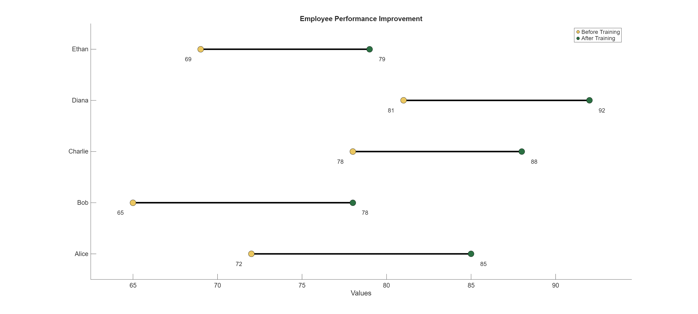
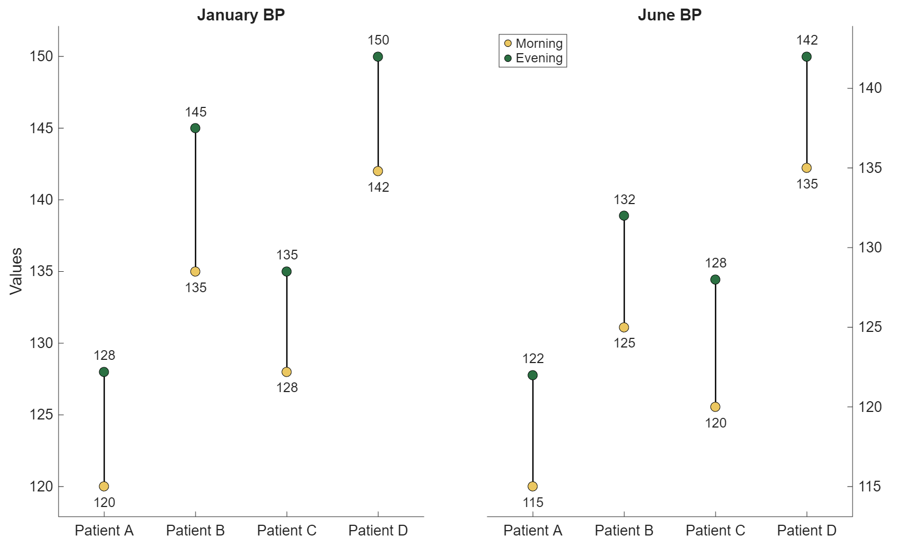
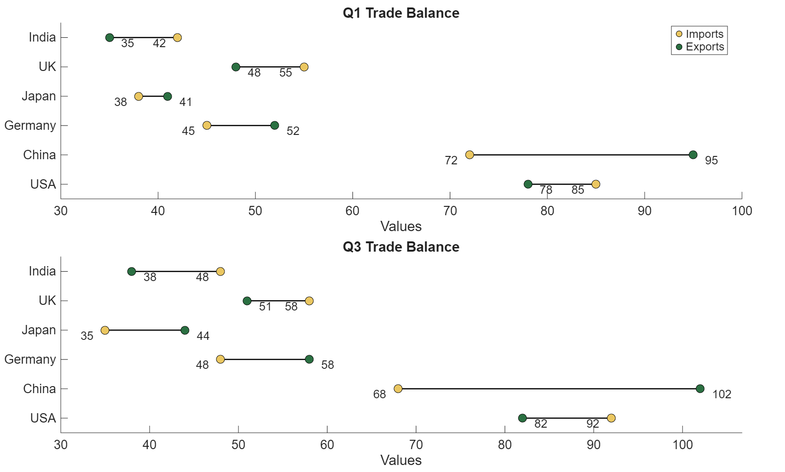
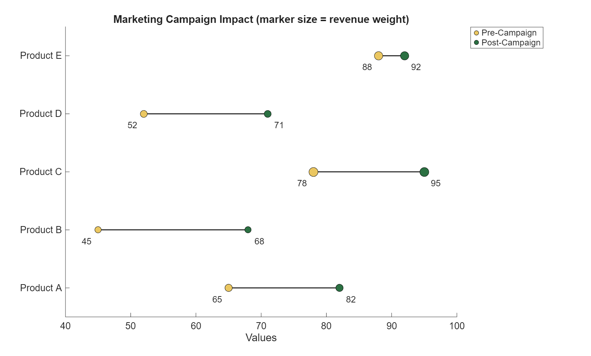
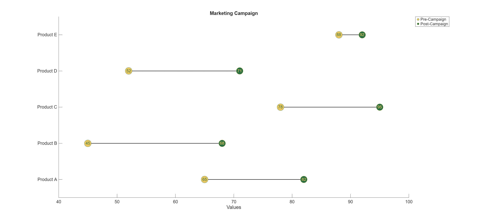

# Dumbbell Charts for MATLAB
Function to create a dumbell plot in MATLAB.

I'm developing this project as both a learning experience and an attempt to create something useful for the community.<br/>
The idea came from my professor @MarcoRianiUNIPR, whom I thank for the inspiration.

Suggestions, feedback, and contributions are welcome and encouraged.

Extensive [Documentation](#Documentation) of the function can be found below.

Examples and output graphs can be found in the [Examples](#Examples) of this document.

## Roadmap:
Recently added featurs:
- [x] support for custom colors, marker and fontsize, linewidth
- [x] addition of functionSignatures.json for customized code suggestions
- [x] Option to insert the values of the points inside of the points of the plot

The next additions to the function will be:
- [ ] Improvement of documentation
- [ ] Addition of a graph that creates plots for every pair of variables in a table
- [ ] Option to change the color of the line depending on the distance between the points
- [ ] Option to change the background of the plot to be clearer or more visually appealing
- [ ] Option to add the differences between the points at the side of the plot


# Documentation:
## Required Input Arguments:
**X:**
- Type: Table or numeric vector.
- Purpose: Data to plot. If numeric vector, it represents the first set of data. If table, it can contain at least 1 or 2 column (in the case of a single plot) or at least 4 variables (in the case of a double plot)

## Positional optional Arguments:
**X2:** 
- Type: numeric vector or single column table.
- Purpose: Second set of data for single plots. Required when X is a single column table or numeric vector.

**X3, X4:** 
- Type: numeric vectors
- Purpose: Required when plotType = "double" and X is a numeric input

**varname1, varname2:**
- Type: String or char.
- Purpose: Variable of n dimensional X table to use for plotting

**varname3, varname4:**
- Type: string or character.
- Purpose: Variables of the n dimensional X table to use for plotting in case of plotType "double"

## Optional "Name", Value Arguments

**"plotType", type**
- Type: string OR char
- Accepted values: "single" (default) OR "double"
- Purpose: Determines the type of plot that will be created; "single" creates a single plot, "double" creates a set of 2 plots, useful to compare different years
- Example: dumbbellPlot(X1, X2, X3, X4, "plotType", "double")

**"orientation", orientation**
- Type: string or Char
- Accepted Values: "horizontal" (default) or "vertical"
- Purpose: determines the orientation of the plot.
- Example: dumbbellPlot(X1, X2, X3, X4, "plotType", "double", "orientation", "vertical")

**"LabelX1"**
- Type: string OR char
- Summary: Custom legend label for the first set of data, Default: X1.

**"LabelX2"**
- Type: string or char
- Summary: Custom legend label for the second set of data, Default: X2.

**Title**
- Type: string or char or cell array
- Purpose: plot title(s). number of expected inputs depends on the number of plots. Default for doubles is ["Year1" "Year2"], for the default single is empty
- Example: dumbbellPlot(X1, X2, X3, X4, "plotType", "double", "Title", ["Q1 2025", "Q3 2025"])

**YLabels**
- Type: string or char oR cell array
- Purpose: Custom labels for tick labels, Must match length of input Data. If missing, default will be used ("Row 1", "Row 2", ...)

**Color**
- Type: string, or char or rgb triplet
- Accepted built-in palettes: "default", "colorblind", "ruby_jade", "cherry_sky", "red_blue"
- Purpose: Color of the dots of the plot

**MarkerSize**
- Type numeric scalar or numeric vector
- Purpose: Set size of dots

**LineWidth**
- Type: numeric scalar
- Purpose: width of the lines connecting the dots

**Fontsize**
- Type: numeric scalar
- Purpose: Font size of descriptive text next to datapoints

**TextInside**
- Type: logical
- Purpose: Text inside or outside (default) of the data points

## Output
**ax:**
- Type: axes handles or array of axes handles
- Purpose: Returns the axes handles for the resulting plots, one handle for each created axis

# Examples:
## Single plot
```
%% single plot example
% Employee performance scores before and after training program
employees = {'Alice', 'Bob', 'Charlie', 'Diana', 'Ethan'};
scoreBefore = [72, 65, 78, 81, 69];
scoreAfter = [85, 78, 88, 92, 79];

figure;
dumbbellPlot(scoreBefore, scoreAfter, 'labelX1', 'Before Training', 'labelX2', 'After Training', ...
   'Title', 'Employee Performance Improvement', 'YLabels', employees);
```


## Double Vertical plot
```
%% Example double vertical plot
% Patient health metrics: systolic BP comparison across two time periods
patients = {'Patient A', 'Patient B', 'Patient C', 'Patient D'};

% Period 1: January measurements
jan_morning = [120, 135, 128, 142];
jan_evening = [128, 145, 135, 150];

% Period 2: June measurements (after lifestyle changes)
jun_morning = [115, 125, 120, 135];
jun_evening = [122, 132, 128, 142];

figure;
dumbbellPlot(jan_morning, jan_evening, jun_morning, jun_evening, ...
    'plotType', 'double','orientation', 'vertical','labelX1', 'Morning', ...
    'labelX2', 'Evening','Title', {'January BP', 'June BP'},'YLabels', patients);
```



## double horizontal plot
```
%% double horizontal plot
% Quarterly trade data for 6 countries (in billions USD)
countries = {'USA', 'China', 'Germany', 'Japan', 'UK', 'India'};

% Q1 data
q1_imports = [85, 72, 45, 38, 55, 42];
q1_exports = [78, 95, 52, 41, 48, 35];  

% Q3 data  
q3_imports = [92, 68, 48, 35, 58, 48];
q3_exports = [82, 102, 58, 44, 51, 38];  

% Create table with all 4 variables
tradeData = table(q1_imports', q1_exports', q3_imports', q3_exports','VariableNames', ...
    {'Q1_Imports', 'Q1_Exports', 'Q3_Imports', 'Q3_Exports'}, 'RowNames', countries);

figure;
dumbbellPlot(tradeData,'Q1_Imports', 'Q1_Exports', 'Q3_Imports', 'Q3_Exports', ...
    'plotType','double','orientation','horizontal', 'labelX1', 'Imports','labelX2', ...
    'Exports','Title', {'Q1 Trade Balance', 'Q3 Trade Balance'});
```


## Dot size based on weight
```
%% Example 4: Size of dots based on weights
products = {'Product A', 'Product B', 'Product C', 'Product D', 'Product E'};
before_campaign = [65, 45, 78, 52, 88];
after_campaign = [82, 68, 95, 71, 92];

% Marker sizes based on revenue importance (arbitrary weights)
importance = [100, 75, 150, 90, 130];

figure;
dumbbellPlot(before_campaign, after_campaign, ...
    'MarkerSize', importance, ...        % Different sizes show importance           
    'labelX1', 'Pre-Campaign', ...
    'labelX2', 'Post-Campaign', ...
    'Title', 'Marketing Campaign Impact (marker size = revenue weight)', ...
    'YLabels', products);
```



## Text inside dots
```
%% Example 5: Text inside dots
products = {'Product A', 'Product B', 'Product C', 'Product D', 'Product E'};
before_campaign = [65, 45, 78, 52, 88];
after_campaign = [82, 68, 95, 71, 92];

figure;
dumbbellPlot(before_campaign, after_campaign, 'labelX1', 'Pre-Campaign', ...
    'labelX2', 'Post-Campaign', 'Title', 'Marketing Campaign', ...
    'YLabels', products, 'TextInside', true);
```

