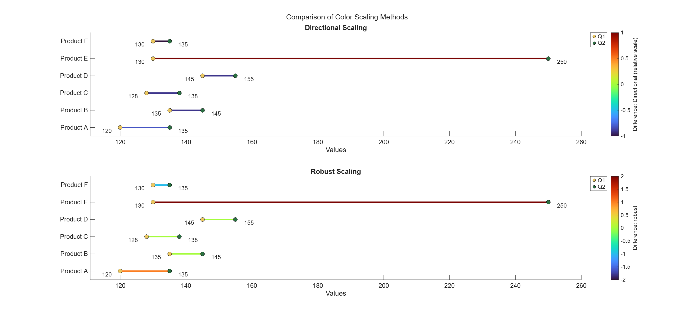
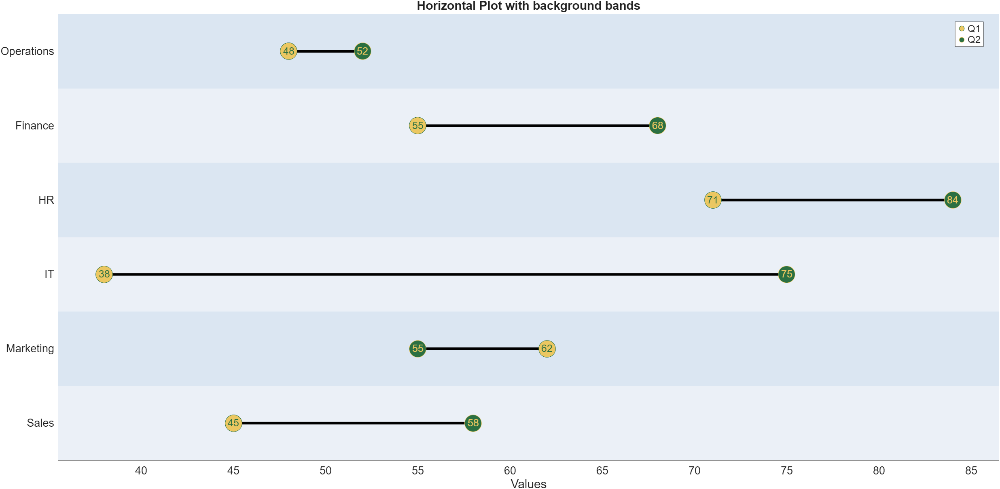

# Gallery
Here you can find a gallery of examples with the corresponding output.

## Example 1: Single Plot
```
% Employee performance scores before and after training program
employees = {'Alice', 'Bob', 'Charlie', 'Diana', 'Ethan'};
scoreBefore = [72, 65, 78, 81, 69];
scoreAfter = [85, 78, 88, 92, 79];

figure;
dumbbellPlot(scoreBefore, scoreAfter, 'labelX1', 'Before Training', 'labelX2', 'After Training', ...
   'Title', 'Employee Performance Improvement', 'YLabels', employees);
```


## Example 2: double vertical plot
A double vertical plot is created by inserting the instruction 'plotType', 'double' and 'orientation', 'vertical'.

This type of plot is useful when comparing 2 sets of data over different periods.

```
% systolic BP comparison across two time periods
patients = {'Patient A', 'Patient B', 'Patient C', 'Patient D'};

% January measurements
jan_morning = [120, 135, 128, 142];
jan_evening = [128, 145, 135, 150];

% June measurements (after lifestyle changes)
jun_morning = [115, 125, 120, 135];
jun_evening = [122, 132, 128, 142];

figure;
dumbbellPlot(jan_morning, jan_evening, jun_morning, jun_evening, ...
    'plotType', 'double','orientation', 'vertical','labelX1', 'Morning', ...
    'labelX2', 'Evening','Title', {'January BP', 'June BP'},'YLabels', patients);
```


## Example 3: double horizontal plot
In this case a similar plot to the one in Example 2 is created; however the
selected orientation is 'horizontal'; which can be specified or left blank, 
since it's the default setting.

```
% Quarterly trade data for 6 countries (in billions USD)
countries = {'USA', 'China', 'Germany', 'Japan', 'UK', 'India'};

q1_imports = [85, 72, 45, 38, 55, 42];
q1_exports = [78, 95, 52, 41, 48, 35];  

q3_imports = [92, 68, 48, 35, 58, 48];
q3_exports = [82, 102, 58, 44, 51, 38];  

tradeData = table(q1_imports', q1_exports', q3_imports', q3_exports','VariableNames', ...
    {'Q1_Imports', 'Q1_Exports', 'Q3_Imports', 'Q3_Exports'}, 'RowNames', countries);

figure;
dumbbellPlot(tradeData,'Q1_Imports', 'Q1_Exports', 'Q3_Imports', 'Q3_Exports', ...
    'plotType','double','orientation','horizontal', 'labelX1', 'Imports','labelX2', ...
    'Exports','Title', {'Q1 Trade Balance', 'Q3 Trade Balance'});
```


## Example 4: Size of dots based on weights
in this example, a vector of the same length as the input vectors is created;
it contains arbitrary weights to be used as sizes for the markers of the plot.

As a result each couple of observations has different marker sizes applied based
on the arbitrary weight that was given to them.

```
products = {'Product A', 'Product B', 'Product C', 'Product D', 'Product E'};
before_campaign = [65, 45, 78, 52, 88];
after_campaign = [82, 68, 95, 71, 92];

% Marker sizes based on revenue importance (arbitrary weights)
importance = [300, 200, 150, 90, 130];

figure;
dumbbellPlot(before_campaign, after_campaign, ...
    'MarkerSize', importance, ...        % Different sizes show importnace           
    'labelX1', 'Pre-Campaign', ...
    'labelX2', 'Post-Campaign', ...
    'Title', 'Marketing Campaign Impact (marker size = revenue weight)', ...
    'YLabels', products);
```


## Example 5: Descriptive text inside dots
The option "TextInside", true; produces a plot with the decriptive text 
inside the dots of the plot

```
products = {'Product A', 'Product B', 'Product C', 'Product D', 'Product E'};
before_campaign = [65, 45, 78, 52, 88];
after_campaign = [82, 68, 95, 71, 92];

figure;
dumbbellPlot(before_campaign, after_campaign, 'labelX1', 'Before-Campaign', ...
    'labelX2', 'After-Campaign', 'Title', 'Marketing Campaign', ...
    'YLabels', products, 'TextInside', true);
```


## Example 6: Directional vs Robust Color Scaling with an Outlier
This example demonstrates the difference between standard and robust scaling 
methods when colouring the bars based on the difference between pairs of data.

In the first plot the presence of the outlier, pushes all the other bars to 
the bottom of the colourmap; colouring them with blue. However, in the second plot, 
the robust scaling is applied, and while the couple with the outlier retains 
its extreme colour, the other couples colour is not influenced by the presence 
of the outlier value.

```
% Demonstrates the difference between standard and robust scaling methods

% Sample data with outlier
products = {'Product A', 'Product B', 'Product C', 'Product D', 'Product E', 'Product F'};
Q1_sales = [120, 135, 128, 145, 130, 130];
Q2_sales = [135, 145, 138, 155, 250, 135]; % Q2 contains an outlier!!! 

figure;

subplot(2, 1, 1);
dumbbellPlot(Q1_sales, Q2_sales,'YLabels', products,'labelX1', 'Q1','labelX2', 'Q2', ...
    'Title', 'Directional Scaling','ColorDist', 'directional','LineWidth', 3);

subplot(2, 1, 2);
dumbbellPlot(Q1_sales, Q2_sales, 'YLabels', products, 'labelX1', 'Q1', ...
    'labelX2', 'Q2','Title', 'Robust Scaling','ColorDist', 'robust', 'LineWidth', 3);

sgtitle('Comparison of Color Scaling Methods')
```



## Example7: Background bands added to plot
In this example, horizontal background bands are added to the plot with the 
instruction "Background", "bands". In case of a vertically oriented plot, the 
bands will be vertical as well.

```
X1 = [45, 62, 38, 71, 55, 48];
X2 = [58, 55, 75, 84, 68, 52];
categories = {'Sales', 'Marketing', 'IT', 'HR', 'Finance', 'Operations'};

figure;
dumbbellPlot(X1,X2, "YLabels", categories, "Title", "Horizontal Plot with background bands", ...
    "TextInside", true, "labelX1","Q1", "labelX2", "Q2", "Background", "bands");
```

